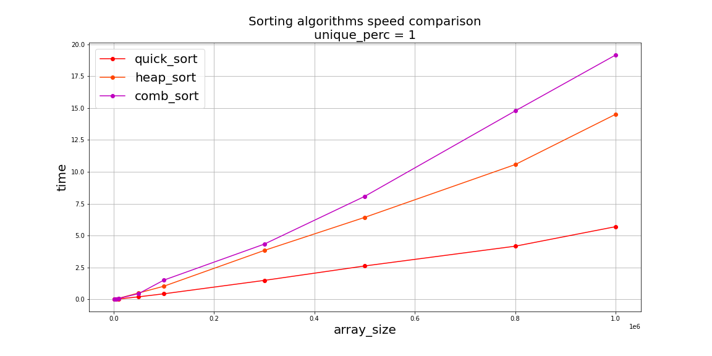
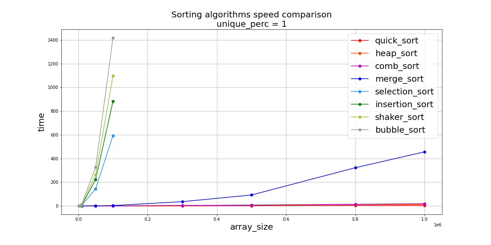

# Sorting algorithms comparison

This repository provides simple cheatsheet for _sorting algorithms_ in my own implementation with _Python_.

## Navigation
- `speed_test.ipynb` -- notebook with sorting speed comparisons;
- `main.py` -- launches sorted test;
- `sorts/` -- contains sorting algorithms.

## Some results

## Sources
- [Introduction to Algorithms, Third Edition](https://mitpress.mit.edu/books/introduction-algorithms-third-edition)
